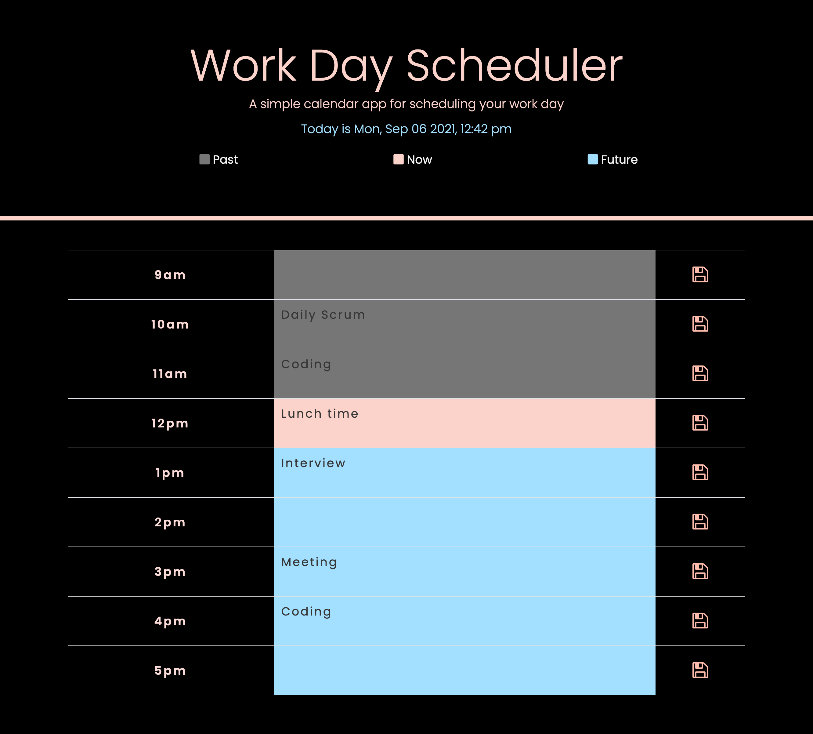

# 05 Third-Party APIs: Work Day Scheduler

## Description 

A simple work day scheduler for easily adding or deleting hourly tasks.

### User Story

```md
AS AN employee with a busy schedule
I WANT to add important events to a daily planner
SO THAT I can manage my time effectively
```

### Acceptance Criteria

```md
GIVEN I am using a daily planner to create a schedule
WHEN I open the planner
THEN the current day is displayed at the top of the calendar
WHEN I scroll down
THEN I am presented with timeblocks for standard business hours
WHEN I view the timeblocks for that day
THEN each timeblock is color coded to indicate whether it is in the past, present, or future
WHEN I click into a timeblock
THEN I can enter an event
WHEN I click the save button for that timeblock
THEN the text for that event is saved in local storage
WHEN I refresh the page
THEN the saved events persist
```

## Technology used

Used jQuery, bootstrap, moment.js to create a simple calendar application that allows a user to save events for each hour of the day.


## License

[](https://www.gnu.org/licenses/MIT%20License)

## Others

For a better user experience:

1. Added an alert to let the user know the task was saved after he or she clicks the save button.
2. Added colored square icon to show the user past, now, and fututre.



[Click me for website](https://mt0814.github.io/Week5-Work-Day-Scheduler/)

---

© 2021 Trilogy Education Services, LLC, a 2U, Inc. brand. Confidential and Proprietary. All Rights Reserved.
